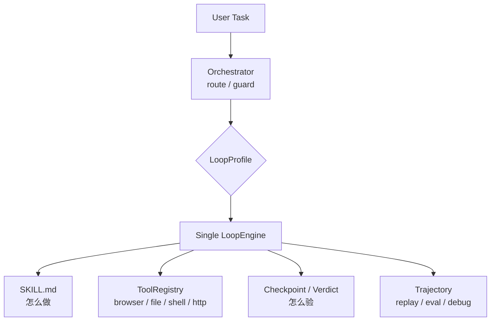

# KeiGent

> **可切换 Loop 的 Agent Runtime / Operations Workbench**
>
> 同一个参数化引擎，通过 `LoopProfile` 切换轻量对话、发散调研、精确执行与强验证执行，并通过 workflow envelope 承载父级治理。

TypeScript · pnpm monorepo · 基于 [`@earendil-works/pi-ai`](https://www.npmjs.com/package/@earendil-works/pi-ai)

---

## KeiGent 是什么？

KeiGent 不是普通聊天机器人，也不是任意多 agent 拼图框架。它的核心命题是：

> **不同任务需要不同的 agent loop 纪律。**

- 开放调研需要发散注意力。
- 精确执行需要收敛注意力。
- 高风险/难验证任务需要证据与审批。
- 闲聊与能力询问不应该进入复杂执行循环。

KeiGent 因此采用：

- **一个 `LoopEngine`**：统一循环骨架。
- **多个 `LoopProfile`**：切换 attention、terminate、verify、recover、memory 策略。
- **Skill-driven execution**：skill 负责“怎么做”。
- **Evidence-first verification**：successDef、checkpoint、verdict、trajectory 负责“怎么验”。
- **Eval / Replay / Web Workbench**：让 agent 行为可回归、可审计、可调试。

> 详细架构图与系统说明见 [`doc/design/00-system-overview.md`](doc/design/00-system-overview.md)。

---

## 快速开始

前置：Node ≥ 22.19.0，pnpm ≥ 10。

> 在某些环境中 `pnpm` 不直接在 PATH 上，可以使用 `corepack pnpm ...`。

```bash
# 安装依赖
corepack pnpm install

# 配置运行时参数（协议、模型、路径等）
mkdir -p ~/.keigent
cp config.example.json ~/.keigent/config.json
# 编辑 ~/.keigent/config.json，按需设置协议、模型、路径等非密钥配置

# 开发/CI 环境建议用环境变量注入密钥（优先级高于 config.json）
cp .env.example .env.local
# 编辑 .env.local，填入 KEIGENT_API_KEY
# 可选：KEIGENT_API_PROTOCOL=openai|anthropic
# 可选：KEIGENT_BASE_URL=自定义兼容端点
# 可选：KEIGENT_MODEL_ID=模型 ID

# 配置诊断（密钥会脱敏）
corepack pnpm --filter @keigent/cli start doctor
corepack pnpm --filter @keigent/cli start doctor --compact
corepack pnpm --filter @keigent/cli start config show
corepack pnpm --filter @keigent/cli start config path
corepack pnpm --filter @keigent/cli start config set modelId gpt-4o-mini
corepack pnpm --filter @keigent/cli start config unset modelId

# 本地 Workbench（默认 localhost；只打印启动命令）
corepack pnpm --filter @keigent/cli start web --print

# 最小 starter 验收路径（fixture 结果不证明产品健康或人工接受）
corepack pnpm --filter @keigent/cli start eval smoke --compact
corepack pnpm --filter @keigent/cli start eval real-world --compact

# 对话式 REPL
corepack pnpm --filter @keigent/cli start

# 单次执行模式
corepack pnpm --filter @keigent/cli start "总结一下 https://example.com"
```

默认运行时位置：

| 数据 | 默认位置 | 说明 |
|---|---|---|
| Config | `~/.keigent/config.json` | model/apiKey/headless/maxIterations 等 |
| Skills | `~/.keigent/skills/` | 标准 SKILL.md 技能库 |
| Workspace | `~/.keigent/workspace/` | 文件工具沙箱 |
| Memory | `~/.keigent/memory/` | 记忆存储；执行 loop 默认不写 |
| Runs | `~/.keigent/runs/` | 每次 workflow 的 `record.json`，包含 evidence/risk/replay 摘要 |

---

## 内置 Profile

| Profile | 适用场景 | 行为特征 |
|---|---|---|
| `conversational` | 闲聊、问候、能力询问、模糊意图 | 快速响应；必要时 `ask_user` 澄清 |
| `divergent-research` | 开放探索、调研、信息收集 | 宽注意力；允许学习建议 |
| `convergent-exec` | 有匹配 skill 的精确执行 | 窄注意力；按步骤执行；自检验证 |
| `convergent-verified` | 难验证、高代价、高风险任务 | 收敛执行 + 独立裁判验证 |

默认 `profile: "auto"`，由 Orchestrator 通过规则分类、LLM fallback 与 guard 自动选择。

---

## 架构速览



三条核心边界：

1. **一个 LoopEngine**：行为差异来自 profile，不复制多个 loop。
2. **Skill 决定怎么做，引擎决定怎么验**。
3. **Final text 不是成功证据**；成功必须能被 evidence / verdict / trajectory 支撑。

更多图示：[`doc/design/00-system-overview.md`](doc/design/00-system-overview.md)。

---

## 常用命令

```bash
# 安装 / 构建 / 类型检查 / 测试
corepack pnpm install
corepack pnpm -r --if-present build
corepack pnpm -r check
corepack pnpm -r test
corepack pnpm --filter @keigent/engine dev

# CLI
corepack pnpm --filter @keigent/cli start
corepack pnpm --filter @keigent/cli start "任务描述"
corepack pnpm --filter @keigent/cli start doctor
corepack pnpm --filter @keigent/cli start doctor --json
corepack pnpm --filter @keigent/cli start config init
corepack pnpm --filter @keigent/cli start config show
corepack pnpm --filter @keigent/cli start config path
corepack pnpm --filter @keigent/cli start eval smoke
corepack pnpm --filter @keigent/cli start eval orchestrator
corepack pnpm --filter @keigent/cli start eval real-world --compact
corepack pnpm --filter @keigent/cli start eval replay --trajectory smoke-conversational-hello=/path/to/trajectory.json
corepack pnpm --filter @keigent/cli start replay /path/to/trajectory.json
corepack pnpm --filter @keigent/cli start web --print

# Engine 单项验证
corepack pnpm --filter @keigent/engine verify:attention
corepack pnpm --filter @keigent/engine verify:browser

# Eval Harness
corepack pnpm --filter @keigent/engine eval:smoke
corepack pnpm --filter @keigent/engine eval:orchestrator
corepack pnpm --filter @keigent/engine eval:real-world -- --compact
corepack pnpm --filter @keigent/engine exec vitest run src/__tests__/eval-replay.test.ts
```

REPL 内斜杠命令：`/help` `/profile <name>` `/skills` `/headed` `/headless` `/quit`。

---

## Eval Harness

Eval Harness 是 KeiGent 的工程化验收层，不新增 agent 行为，只负责：

1. 定义任务集。
2. 运行任务并收集事件与 trajectory。
3. 按验收规则评分。
4. 输出机器可读 JSON 报告。

| 命令 | 说明 |
|---|---|
| `eval:smoke` | 不调 LLM，用 smoke executor 验证 runner/report 本身 |
| `eval:replay -- --trajectory case-id=/path/to/trajectory.json` | 从已保存 trajectory 派生结果，离线重评历史轨迹 |
| `eval:orchestrator` | 纯规则跑 fixture，验证 Orchestrator profile 选择零退化 |
| `eval:real-world -- --compact` | L2 本地真实任务 fixture 基线，分开统计 route/task/evidence/risk/false confidence |

当前确定性 smoke suite 覆盖 57 个产品用例，其中 browser 类 10 个；orchestrator suite 覆盖 32 个路由 fixture；real-world L2 suite 覆盖 8 个本地任务基线。CLI 也提供 `keigent eval smoke/orchestrator/real-world/replay` 和 `keigent replay <trajectory>` 包装入口。

真实 replay 需要显式指定 case 与 trajectory 文件：

```bash
corepack pnpm --filter @keigent/engine eval:replay -- --trajectory smoke-conversational-hello=/path/to/trajectory.json
corepack pnpm --filter @keigent/cli start eval replay --trajectory smoke-conversational-hello=/path/to/trajectory.json
```

重要边界：Eval pass 不等于产品完全可信；profile accuracy 不等于任务成功；tool attempted 不等于 tool succeeded；replay pass 不等于 fresh execution pass。

---

## 项目结构

```text
packages/
├── engine/              # @keigent/engine —— LoopEngine、profiles、tools、workflow、evals
├── cli/                 # @keigent/cli —— REPL、单次模式、配置诊断
└── web/                 # @keigent/web —— Web Workbench 视图模型阶段

skills/                  # 标准 SKILL.md 示例与学习笔记
doc/design/              # 架构与特性设计文档
doc/product/             # 产品蓝图与用户体验文档
doc/evals/               # Eval/benchmark 设计文档
doc/strategy/            # 架构边界与非目标
doc/references/          # 参考项目研读（hermes-agent、openhuman）
```

---

## 质量门

合并主线前建议至少运行完整质量门：

```bash
corepack pnpm --filter @keigent/engine check
corepack pnpm --filter @keigent/cli check
corepack pnpm --filter @keigent/web check
corepack pnpm --filter @keigent/engine test
corepack pnpm --filter @keigent/cli test
corepack pnpm --filter @keigent/web test
corepack pnpm --filter @keigent/engine eval:smoke
corepack pnpm --filter @keigent/engine eval:orchestrator
corepack pnpm --filter @keigent/engine eval:real-world -- --compact
corepack pnpm --filter @keigent/engine exec vitest run src/__tests__/eval-replay.test.ts
corepack pnpm --filter @keigent/engine verify:browser
git diff --check
```

`eval:replay` 的 CLI 形式需要传入 `--trajectory case-id=/path/to/trajectory.json`；仓库内置 replay fixture 的回归由 `eval-replay.test.ts` 覆盖。

---

## 文档地图

### 入口与总览

- [事实源] [`doc/design/00-system-overview.md`](doc/design/00-system-overview.md) —— 系统总览与架构图
- [文档索引] [`doc/design/README.md`](doc/design/README.md) —— 设计文档状态地图
- [产品蓝图] [`doc/product/01-product-blueprint.md`](doc/product/01-product-blueprint.md) —— 产品定位、用户、成熟度、模块地图
- [策略边界] [`doc/strategy/01-architecture-boundaries-and-non-goals.md`](doc/strategy/01-architecture-boundaries-and-non-goals.md) —— 架构边界与非目标

### 主架构与已实现能力

- [事实源] [`doc/design/01-architecture.md`](doc/design/01-architecture.md) —— 当前架构事实源
- [实现说明] [`doc/design/02-conversational-fallback.md`](doc/design/02-conversational-fallback.md) —— 对话兜底分支 + 分类误判修复
- [实现说明] [`doc/design/03-eval-harness.md`](doc/design/03-eval-harness.md) —— Eval Harness 与验收标准
- [设计蓝图] [`doc/design/04-web-conversation-panel.md`](doc/design/04-web-conversation-panel.md) —— Web 对话面板设计
- [设计蓝图] [`doc/design/05-web-dashboard.md`](doc/design/05-web-dashboard.md) —— Web Eval Dashboard 设计
- [实现说明] [`doc/design/06-cli-config-and-web-config.md`](doc/design/06-cli-config-and-web-config.md) —— CLI 与 Web 配置系统
- [实现说明] [`doc/design/07-workflow-run-envelope.md`](doc/design/07-workflow-run-envelope.md) —— Workflow Run Envelope 与 child execution evidence

### 治理、证据、调试与失败语义

- [事实源] [`doc/design/08-success-evidence-model.md`](doc/design/08-success-evidence-model.md) —— SuccessDef / Assertion / Evidence 成功证据模型
- [事实源] [`doc/design/09-permission-risk-governance.md`](doc/design/09-permission-risk-governance.md) —— 权限、风险与人类审批治理
- [产品语义] [`doc/design/10-workflow-modes-product-semantics.md`](doc/design/10-workflow-modes-product-semantics.md) —— Workflow modes 产品语义与边界
- [事实源] [`doc/design/11-skill-lifecycle-and-governance.md`](doc/design/11-skill-lifecycle-and-governance.md) —— Skill 生命周期与知识治理
- [事实源] [`doc/design/12-agent-debuggability.md`](doc/design/12-agent-debuggability.md) —— Agent 可调试性与解释事实源
- [事实源] [`doc/design/13-failure-recovery-semantics.md`](doc/design/13-failure-recovery-semantics.md) —— 失败语义与恢复策略

### 产品、Eval 与协作者指引

- [产品蓝图] [`doc/product/02-task-taxonomy-and-routing.md`](doc/product/02-task-taxonomy-and-routing.md) —— 任务分类、profile/mode/risk 路由矩阵
- [产品蓝图] [`doc/product/03-web-workbench-blueprint.md`](doc/product/03-web-workbench-blueprint.md) —— Agent Operations Workbench 信息架构
- [产品蓝图] [`doc/product/04-local-runtime-experience.md`](doc/product/04-local-runtime-experience.md) —— 本地安装、首次运行、失败体验
- [产品规格] [`doc/product/05-run-record-and-run-lifecycle.md`](doc/product/05-run-record-and-run-lifecycle.md) —— 下一阶段 P0：RunRecord、生命周期、证据归档与复盘边界
- [产品规格] [`doc/product/06-skill-governance-product-spec.md`](doc/product/06-skill-governance-product-spec.md) —— 下一阶段 P0：skill 生命周期、晋升门槛、eval guard 与回滚边界
- [产品旅程] [`doc/product/07-local-operator-user-journeys.md`](doc/product/07-local-operator-user-journeys.md) —— operator 安装、执行、审批、复盘、skill 晋升与 eval 旅程
- [开发要求] [`doc/product/08-loop-engineering-development-requirements.md`](doc/product/08-loop-engineering-development-requirements.md) —— Loop Engineering 对 automation、worktree、skill、connector、sub-agent、memory 的产品约束
- [成熟路线图] [`doc/product/09-agent-operations-maturity-roadmap.md`](doc/product/09-agent-operations-maturity-roadmap.md) —— Run 可审计、Eval 可复盘、Loop 可治理、Ops 可扩展的下一阶段任务与验收标准
- [发布入口] [`doc/product/10-release-and-upgrade.md`](doc/product/10-release-and-upgrade.md) —— first-run guide、config upgrade policy、release checklist、changelog 与版本兼容边界
- [设计蓝图] [`doc/evals/01-real-world-eval-suite.md`](doc/evals/01-real-world-eval-suite.md) —— 真实世界 Eval Suite 蓝图
- [验收报告] [`doc/evals/02-main-acceptance-report.md`](doc/evals/02-main-acceptance-report.md) —— main 分支产品/架构验收意见
- [Eval 路线图] [`doc/evals/03-real-world-eval-roadmap.md`](doc/evals/03-real-world-eval-roadmap.md) —— L1/L2/L3 分层 eval 与 false confidence 防线
- [协作者入口] [`AGENTS.md`](AGENTS.md) —— 给 AI 协作者的当前项目契约

---

## 已知约束

- **REPL 跨轮无对话历史**：每轮输入是独立的一次 `engine.run`。
- **单次模式非交互**：`ask_user` 无人可答时会降级。
- **Web 已有前端内存事件流 Live Run Console、Web Run Launcher、Run Detail v1、Skill Workbench、Eval Dashboard 与本地 API/SSE foundation**：可展示 live/replay event timeline、pending tool/checkpoint/approval、RunRecord 审计、skill 状态/注入原因/eval coverage，以及 eval case 到 run detail 的链接与 false-confidence findings；`keigent web --api` 可启动本地 API，前端通过 `VITE_KEIGENT_API_URL` 读取 run store、发起 web-sourced run，并订阅 run session event stream。完整交互式 Workbench 尚未实现。
- **Workflow P0 是保守 envelope**：不声明 fanout/tournament/dynamic planner 已可用。
- **pi-ai gpt-5.5 并发工具调用 bug**：`utils.ts` 的 `deduplicateToolCalls` 统一合并互补 tool-call block。

---

## License

Apache-2.0。贡献规则见 [`CONTRIBUTING.md`](CONTRIBUTING.md)。
