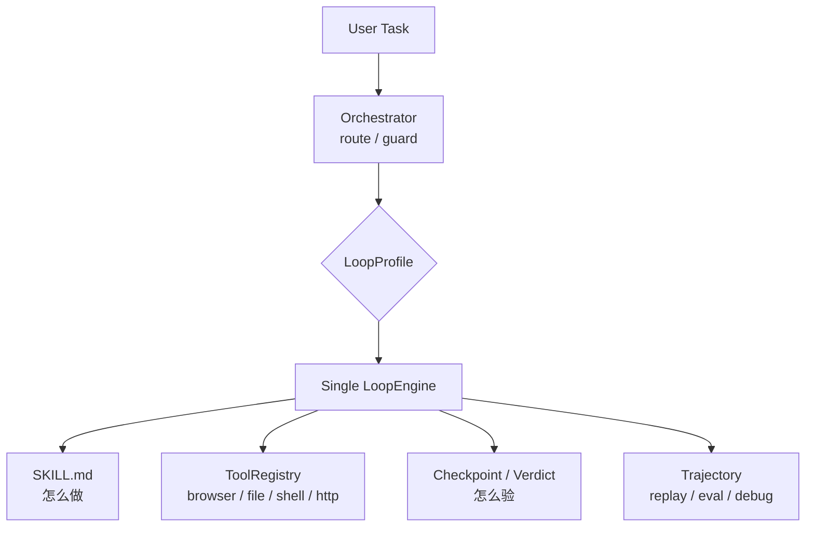

# KeiGent

> **可切换 Loop 的 Agent Runtime / Operations Workbench**
>
> 同一个参数化引擎，通过 `LoopProfile` 切换成轻量对话、发散调研、精确执行、强验证执行与 workflow envelope。

TypeScript · pnpm monorepo · 基于 [`@earendil-works/pi-ai`](https://www.npmjs.com/package/@earendil-works/pi-ai)

---

## KeiGent 是什么？

KeiGent 不是普通聊天机器人，也不是任意多 agent 拼图框架。它的核心命题是：

> **不同任务需要不同的 agent loop 纪律。**

- 开放调研需要发散注意力。
- 精确执行需要收敛注意力。
- 高风险/难验证任务需要证据与审批。
- 闲聊与能力询问不应该进入复杂执行循环。

KeiGent 因此采用：

- **一个 `LoopEngine`**：统一循环骨架。
- **多个 `LoopProfile`**：切换 attention、terminate、verify、recover、memory 策略。
- **Skill-driven execution**：skill 负责“怎么做”。
- **Evidence-first verification**：successDef、checkpoint、verdict、trajectory 负责“怎么验”。
- **Eval / Replay / Web Workbench**：让 agent 行为可回归、可审计、可调试。

> 详细架构图与系统说明见 [`doc/design/00-system-overview.md`](doc/design/00-system-overview.md)。

---

## 快速开始

前置：Node ≥ 22.19.0，pnpm ≥ 10。

> 在某些环境中 `pnpm` 不直接在 PATH 上，可以使用 `corepack pnpm ...`。

```bash
# 安装依赖
corepack pnpm install

# 配置 API key
cp .env.example .env.local
# 编辑 .env.local，填入 KEIGENT_API_KEY=sk-xxx
# 可选：KEIGENT_API_PROTOCOL=openai|anthropic
# 可选：KEIGENT_BASE_URL=自定义兼容端点
# 可选：KEIGENT_MODEL_ID=模型 ID

# 配置诊断（密钥会脱敏）
corepack pnpm --filter @keigent/cli start doctor
corepack pnpm --filter @keigent/cli start config show

# 对话式 REPL
corepack pnpm --filter @keigent/cli start

# 单次执行模式
corepack pnpm --filter @keigent/cli start "总结一下 https://example.com"
```

默认运行时位置：

| 数据 | 默认位置 | 说明 |
|---|---|---|
| Config | `~/.keigent/config.json` | model/apiKey/headless/maxIterations 等 |
| Skills | `~/.keigent/skills/` | 标准 SKILL.md 技能库 |
| Workspace | `~/.keigent/workspace/` | 文件工具沙箱 |
| Memory | `~/.keigent/memory/` | 记忆存储；执行 loop 默认不写 |

---

## 内置 Profile

| Profile | 适用场景 | 行为特征 |
|---|---|---|
| `conversational` | 闲聊、问候、能力询问、模糊意图 | 快速响应；必要时 `ask_user` 澄清 |
| `divergent-research` | 开放探索、调研、信息收集 | 宽注意力；允许学习建议 |
| `convergent-exec` | 有匹配 skill 的精确执行 | 窄注意力；按步骤执行；自检验证 |
| `convergent-verified` | 难验证、高代价、高风险任务 | 收敛执行 + 独立裁判验证 |

默认 `profile: "auto"`，由 Orchestrator 通过规则分类、LLM fallback 与 guard 自动选择。

---

## 架构速览



三条核心边界：

1. **一个 LoopEngine**：行为差异来自 profile，不复制多个 loop。
2. **Skill 决定怎么做，引擎决定怎么验**。
3. **Final text 不是成功证据**；成功必须能被 evidence / verdict / trajectory 支撑。

更多图示：[`doc/design/00-system-overview.md`](doc/design/00-system-overview.md)。

---

## 常用命令

```bash
# 安装 / 构建 / 类型检查 / 测试
corepack pnpm install
corepack pnpm build
corepack pnpm check
corepack pnpm test
corepack pnpm dev

# CLI
corepack pnpm --filter @keigent/cli start
corepack pnpm --filter @keigent/cli start "任务描述"
corepack pnpm --filter @keigent/cli start doctor
corepack pnpm --filter @keigent/cli start doctor --json
corepack pnpm --filter @keigent/cli start config show

# Engine 单项验证
corepack pnpm --filter @keigent/engine verify:attention
corepack pnpm --filter @keigent/engine verify:browser

# Eval Harness
corepack pnpm --filter @keigent/engine eval:smoke
corepack pnpm --filter @keigent/engine eval:replay
corepack pnpm --filter @keigent/engine eval:orchestrator
```

REPL 内斜杠命令：`/help` `/profile <name>` `/skills` `/headed` `/headless` `/quit`。

---

## Eval Harness

Eval Harness 是 KeiGent 的工程化验收层，不新增 agent 行为，只负责：

1. 定义任务集。
2. 运行任务并收集事件与 trajectory。
3. 按验收规则评分。
4. 输出机器可读 JSON 报告。

| 命令 | 说明 |
|---|---|
| `eval:smoke` | 不调 LLM，用 smoke executor 验证 runner/report 本身 |
| `eval:replay` | 从已保存 trajectory 派生结果，离线重评历史轨迹 |
| `eval:orchestrator` | 纯规则跑 fixture，验证 Orchestrator profile 选择零退化 |

重要边界：Eval pass 不等于产品完全可信；profile accuracy 不等于任务成功；tool attempted 不等于 tool succeeded；replay pass 不等于 fresh execution pass。

---

## 项目结构

```text
packages/
├── engine/              # @keigent/engine —— LoopEngine、profiles、tools、workflow、evals
├── cli/                 # @keigent/cli —— REPL、单次模式、配置诊断
└── web/                 # @keigent/web —— Web Workbench 视图模型阶段

skills/                  # 标准 SKILL.md mock skill 库
doc/design/              # 架构与特性设计文档
doc/product/             # 产品蓝图与用户体验文档
doc/evals/               # Eval/benchmark 设计文档
doc/strategy/            # 架构边界与非目标
doc/references/          # 参考项目研读（hermes-agent、openhuman）
```

---

## 质量门

合并主线前建议至少运行：

```bash
corepack pnpm --filter @keigent/cli test
corepack pnpm --filter @keigent/engine test
corepack pnpm -r check
corepack pnpm --filter @keigent/engine eval:smoke
corepack pnpm --filter @keigent/engine eval:orchestrator
```

---

## 文档地图

### 入口与总览

- [`doc/design/00-system-overview.md`](doc/design/00-system-overview.md) —— 系统总览与架构图
- [`doc/product/01-product-blueprint.md`](doc/product/01-product-blueprint.md) —— 产品定位、用户、成熟度、模块地图
- [`doc/strategy/01-architecture-boundaries-and-non-goals.md`](doc/strategy/01-architecture-boundaries-and-non-goals.md) —— 架构边界与非目标

### 主架构与已实现能力

- [`doc/design/01-architecture.md`](doc/design/01-architecture.md) —— 主架构设计：五旋钮、三层结构、LoopEngine 推导
- [`doc/design/02-conversational-fallback.md`](doc/design/02-conversational-fallback.md) —— 对话兜底分支 + 分类误判修复
- [`doc/design/03-eval-harness.md`](doc/design/03-eval-harness.md) —— Eval Harness 设计与验收标准
- [`doc/design/04-web-conversation-panel.md`](doc/design/04-web-conversation-panel.md) —— Web 对话面板设计
- [`doc/design/05-web-dashboard.md`](doc/design/05-web-dashboard.md) —— Web Eval Dashboard 设计
- [`doc/design/06-cli-config-and-web-config.md`](doc/design/06-cli-config-and-web-config.md) —— CLI 与 Web 配置系统设计
- [`doc/design/07-workflow-run-envelope.md`](doc/design/07-workflow-run-envelope.md) —— Workflow Run Envelope 与 child execution evidence

### 治理、证据、调试与失败语义

- [`doc/design/08-success-evidence-model.md`](doc/design/08-success-evidence-model.md) —— SuccessDef / Assertion / Evidence 成功证据模型
- [`doc/design/09-permission-risk-governance.md`](doc/design/09-permission-risk-governance.md) —— 权限、风险与人类审批治理
- [`doc/design/10-workflow-modes-product-semantics.md`](doc/design/10-workflow-modes-product-semantics.md) —— Workflow modes 产品语义与边界
- [`doc/design/11-skill-lifecycle-and-governance.md`](doc/design/11-skill-lifecycle-and-governance.md) —— Skill 生命周期与知识治理
- [`doc/design/12-agent-debuggability.md`](doc/design/12-agent-debuggability.md) —— Agent 可调试性与解释事实源
- [`doc/design/13-failure-recovery-semantics.md`](doc/design/13-failure-recovery-semantics.md) —— 失败语义与恢复策略

### 产品、Eval 与协作者指引

- [`doc/product/02-task-taxonomy-and-routing.md`](doc/product/02-task-taxonomy-and-routing.md) —— 任务分类、profile/mode/risk 路由矩阵
- [`doc/product/03-web-workbench-blueprint.md`](doc/product/03-web-workbench-blueprint.md) —— Agent Operations Workbench 信息架构
- [`doc/product/04-local-runtime-experience.md`](doc/product/04-local-runtime-experience.md) —— 本地安装、首次运行、失败体验
- [`doc/evals/01-real-world-eval-suite.md`](doc/evals/01-real-world-eval-suite.md) —— 真实世界 Eval Suite 蓝图
- [`CLAUDE.md`](CLAUDE.md) —— 给 AI 协作者的项目指引

---

## 已知约束

- **REPL 跨轮无对话历史**：每轮输入是独立的一次 `engine.run`。
- **单次模式非交互**：`ask_user` 无人可答时会降级。
- **Web 仍是设计/视图模型阶段**：完整可视化 UI 尚未实现。
- **Workflow P0 是保守 envelope**：不声明 fanout/tournament/dynamic planner 已可用。
- **pi-ai gpt-5.5 并发工具调用 bug**：`utils.ts` 的 `deduplicateToolCalls` 统一合并互补 tool-call block。

---

## License

当前仓库未声明公开许可证；发布前需要补充许可证与贡献规则。
