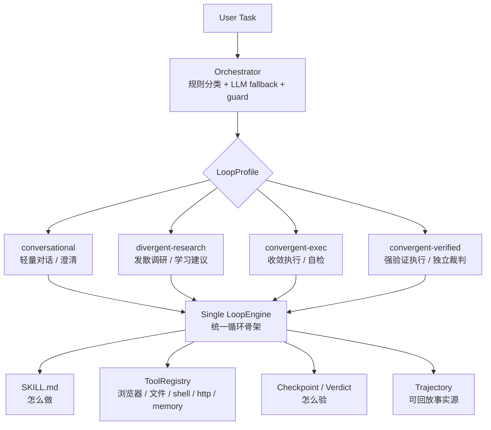
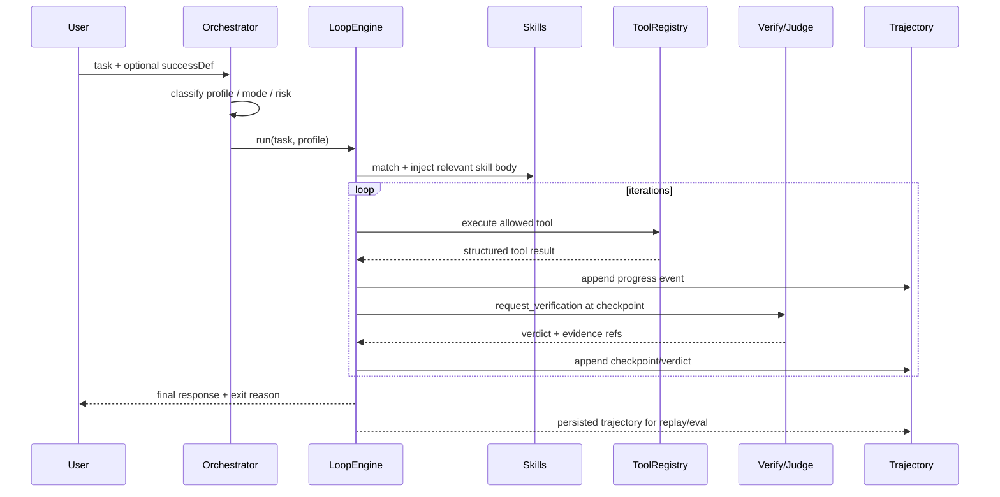
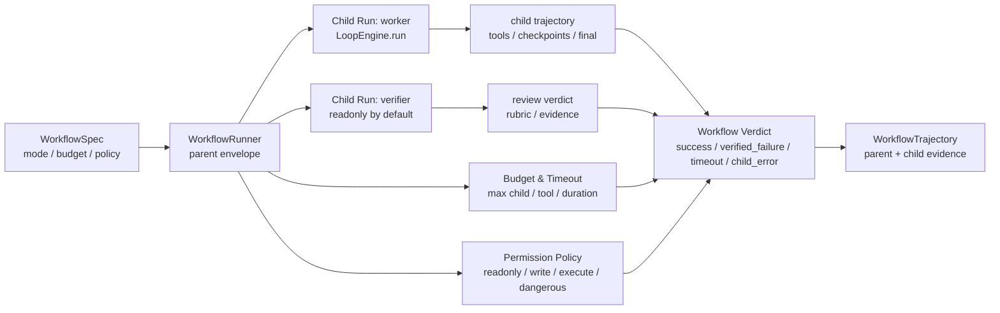
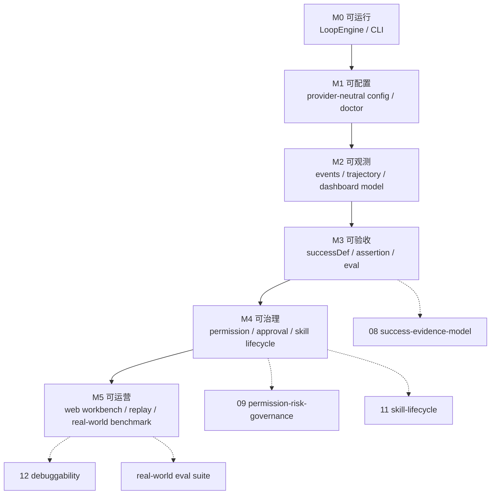

# KeiGent System Overview

> 目的：承接 README 中不适合展开的系统说明与架构图，作为项目入口后的详细阅读文档。
>
> 读者：产品负责人、架构师、实现者、验收人、AI 协作者。

## 1. 项目定位

KeiGent 是一个 **skill-driven、profile-switchable、evidence-first 的 Agent Runtime / Operations Workbench**。

它不是普通聊天机器人，也不是任意多 agent 拼图框架。它要解决的是：

> 不同任务需要不同的 agent loop 纪律。

- 开放研究需要发散注意力。
- 精确执行需要收敛注意力。
- 难验证/高风险任务需要证据与审批。
- 闲聊与能力询问不应该进入复杂执行循环。

因此 KeiGent 的核心形态是：

1. **Agent Runtime**：统一 `LoopEngine`、profile、tool registry、trajectory、workflow envelope。
2. **Skill-driven Execution Engine**：skill 负责“怎么做”，引擎负责“怎么验”。
3. **Evidence-first Framework**：final text 不能单独证明成功；成功要有 checkpoint、verdict、assertion、trajectory。
4. **Local Agent Operations Workbench**：通过 CLI/Web/Eval/Replay 支持执行、审计、配置、回归和 skill 治理。

## 2. 核心架构图

### 2.1 一引擎多 Profile

关键点：

- 系统只有一个 `LoopEngine`。
- 行为差异来自 `LoopProfile`，不是复制多个 loop 函数。
- Orchestrator 负责选 profile；profile 负责控制 attention、terminate、verify、recover、memory。

### 2.2 一次 Run 的证据闭环

关键点：

- final response 只是对结果的表达，不是成功事实源。
- 成功由 successDef/assertion/evidence/verdict 共同证明。
- trajectory 是 replay、eval、debugging 的共同事实源。

### 2.3 Workflow Envelope 与治理边界

Workflow 的产品语义：

- Workflow 是 parent envelope，不是第二套执行器。
- Child run 仍然使用 `LoopEngine.run()`。
- Parent 负责预算、失败映射、权限策略、workflow-level evidence 与 trajectory。
- P0 保守支持 `single-loop` 与 `verified-loop`；不声明 fanout/tournament/dynamic planner 已可用。

### 2.4 产品成熟度与文档地图

## 3. 五个 Profile 旋钮

每个 `LoopProfile` 由五个策略旋钮组成：

| 旋钮 | 接口 | 作用 |
|---|---|---|
| attention | `AttentionStrategy` | 每轮往上下文放什么：skill、memory、工具、裁剪策略 |
| terminate | `TerminateStrategy` | 何时停：模型自判、流程走完、结果匹配 |
| verify | `VerifyStrategy` | 验证强度：不验、自检、独立裁判 |
| recover | `RecoverStrategy` | 失败怎么办：重试、诊断、升级人类 |
| memory | `MemoryStrategy` | 是否沉淀经验：写入、只读、禁写 |

内置 profile：

| Profile | 场景 | 重点 |
|---|---|---|
| `conversational` | 闲聊、问候、能力询问、模糊意图 | 快速响应、必要时澄清 |
| `divergent-research` | 开放调研、探索、总结 | 宽注意力、允许学习建议 |
| `convergent-exec` | 有目标、有 skill 的精确执行 | 窄注意力、步骤纪律、自检 |
| `convergent-verified` | 高风险/难验证任务 | 强验证、独立裁判、证据优先 |

## 4. 关键事实源

| 事实源 | 负责回答 | 相关文档 |
|---|---|---|
| `Task` | 用户想做什么 | `02-task-taxonomy-and-routing.md` |
| `LoopProfile` | 用什么执行纪律 | `01-architecture.md` |
| `SuccessDef` / `Assertion` | 什么叫成功 | `08-success-evidence-model.md` |
| `ToolRegistry` / Policy | 能做什么、是否安全 | `09-permission-risk-governance.md` |
| `Trajectory` | 发生过什么 | `12-agent-debuggability.md` |
| `EvalReport` | 是否回归/退化 | `03-eval-harness.md`、`../evals/01-real-world-eval-suite.md` |
| `Skill` | 应该怎么做 | `11-skill-lifecycle-and-governance.md` |

## 5. 当前不做什么

为了防止架构发散，当前明确不做：

- 自由 JS workflow 脚本。
- 任意 fanout swarm。
- dynamic LLM planner。
- remote multi-user SaaS。
- plugin marketplace。
- 自动晋升正式 skill。
- 无审批危险外部操作。
- provider/relay 品牌化模型入口。

详细边界见 [`doc/strategy/01-architecture-boundaries-and-non-goals.md`](../strategy/01-architecture-boundaries-and-non-goals.md)。
